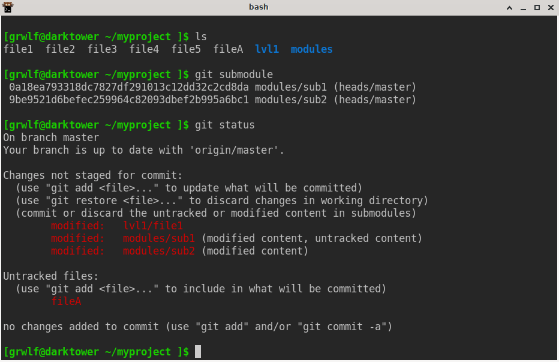

Git Powercommit
===============

This repo contains the end-user [shell script](./git-powercommit) implementing
`git powercommit` command for committing and pushing the changes to your Git
repository. The script uses meaningless commit messages, performs pulls/stashes
as required and supports git submodules. Thus we try to automate a typical work
scenario of a lazy developer.

**Disclaimer: Author tried to make this script clean and simple and even
provided a [test](./test.sh). But you know, Git is a complex thing, something
may not work as expected. Use this script at your own risk.**

The Powercommit algorithm in a nutshell:

1. Check for changes, exit if there are none.
2. Mark the current head with a branch `powercommit`. Exit if the branch already
   exists.
3. Call `git stash`
4. Call `git pull --rebase`
5. Apply the stash
6. Call itself recursively for every git-submodule, unless `--no-recursive` is
   given
7. Commit every changed submodule
8. Commit every changed regular file or folder, aggregating the files that
   share a folder into a single commit.
9. Push the repo upstream
10. Remove the `powercommit` marker branch.
11. Print a summary of untracked files. Highlight files which look like
    source codes.


Usage
-----

1. Drop this [git-powercommit](./git-powercommit) script into one of your PATH
   folders.
2. `cd your-git-repo`
3. Make some changes
4. `git powercommit`




If something goes wrong
-----------------------

If the automation magic fails for some reason, you are advised to review the
`/tmp/git_powercommit_$UID.log` logfile and recover to the starting state
manually:

5. As one of its first steps, powercommit script pins the current state of the
   repo with the `powercommit` branch. On the tip of this branch, it creates the
   stash capturing the currently modified files. Here is how to revert repo to
   the state just before `git powercommit` was called:
    ```sh
    git reset --hard "powercommit"; git stash pop; git branch -D "powercommit"
    ```

You may need to repeat the above sequence for all submodules (recursive abort is
still in the TODO list). The script will refuse to run if the `powercommit`
branch already exists.

Also it is recommended to run the [test](./test.sh) script to check the script
compatibility on mock repos.


TODO
----

* [x] Hide verbose logging into the logfile.
* [x] Nix-expression.
* [x] A Screencast.
* [x] Notify about suspicious untracked files.
* [x] A recursive dry-run mode of execution.
* [ ] Commit added/removed files based on patterns.
* [x] Make recursive recovering from failures.
* [ ] A Manpage.
* [ ] Neural network generating commit messages :pig:


Related links
-------------

* Git status porcelain v2 https://git-scm.com/docs/git-status#_porcelain_format_version_2
* ANSI color codes in terminal https://stackoverflow.com/questions/5947742/how-to-change-the-output-color-of-echo-in-linux
* StackOverflow on generating commit messages https://stackoverflow.com/questions/35010953/how-to-automatically-generate-commit-message
* PwC: On the Evaluation of Commit Message Generation Models: An Experimental Study https://paperswithcode.com/paper/on-the-evaluation-of-commit-message/review/

